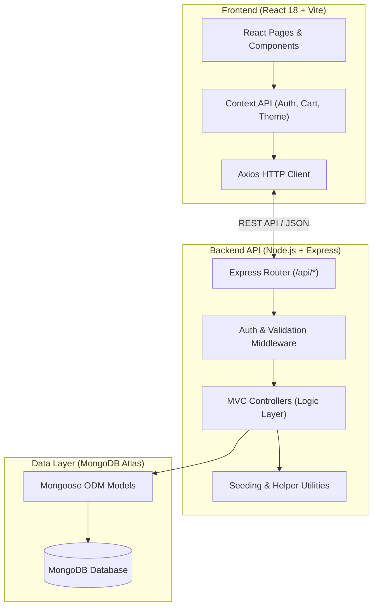
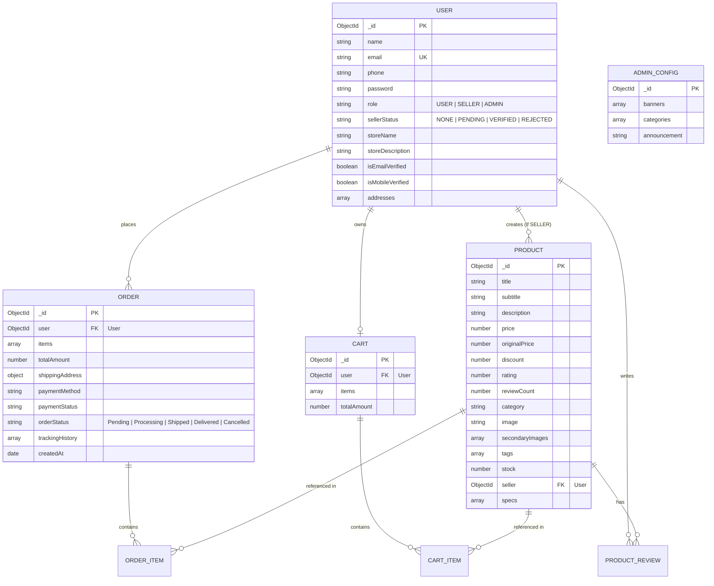
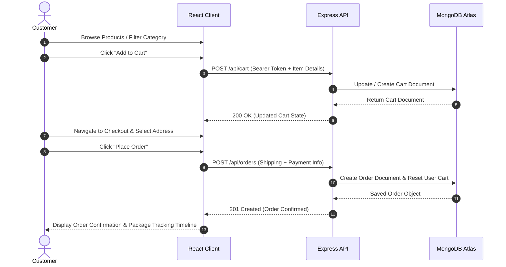

# 🛍️ VizHop - Full-Stack MERN E-Commerce Platform

-blue?style=for-the-badge)


**VizHop** is a modern, high-performance, multi-vendor e-commerce platform built with the **MERN stack (MongoDB, Express.js, React, Node.js)** using clean **MVC Architecture**. It features real-time package tracking timelines, role-based access control (User, Seller, SuperAdmin), OTP-based email verification, interactive analytics dashboards, custom multi-theme switching, and an embedded project spec reviewer.

---

## 📁 Project Resources & Assets

- 📂 **Google Drive Resources & Assets:** [View Google Drive Resources](https://drive.google.com/drive/folders/1J1HJXk0-ulXiSHNRxvw3o8i5y70Qi_ub?usp=drive_link)
- 🔗 **GitHub Repository:** [https://github.com/sakthivigneshv/E-commerce.git](https://github.com/sakthivigneshv/E-commerce.git)

---

## 📋 Table of Contents

1. [Project Architecture & MVC Explanation](#1-project-architecture--mvc-explanation)
   - [System Architecture Diagram](#system-architecture-diagram)
   - [MVC Pattern Explanation](#mvc-pattern-explanation)
   - [Entity-Relationship (ER) Diagram](#entity-relationship-er-diagram)
   - [Core Features](#core-features)
   - [Roles & Responsibilities](#roles--responsibilities)
   - [User Flow Diagrams](#user-flow-diagrams)
2. [Project Setup & Configuration](#2-project-setup--configuration)
   - [Prerequisites](#prerequisites)
   - [Folder Structure](#folder-structure)
   - [Installation Steps](#installation-steps)
   - [Environment Configuration](#environment-configuration)
3. [Backend Development & Database Seeding](#3-backend-development--database-seeding)
   - [Server Entry Point & Middleware](#server-entry-point--middleware)
   - [Database Seeding Workflow](#database-seeding-workflow)
   - [REST API Endpoints Overview](#rest-api-endpoints-overview)
4. [Database Development](#4-database-development)
   - [Database Schemas Breakdown](#database-schemas-breakdown)
5. [Frontend Development](#5-frontend-development)
   - [React 18 + Vite Architecture](#react-18--vite-architecture)
   - [Context API State Management](#context-api-state-management)
   - [Pages & UI Components](#pages--ui-components)
6. [Project Execution](#6-project-execution)
   - [Running Locally](#running-locally)
   - [Production Deployment (Vercel)](#production-deployment-vercel)
7. [GitHub Push Guide](#7-github-push-guide)

---

## 1. Project Architecture & MVC Explanation

### System Architecture Diagram

VizHop uses a decoupled monorepo architecture separating the **React Frontend Client** from the **Express Node.js Backend API**, backed by a **MongoDB Atlas Cloud Database**.



---

### MVC Pattern Explanation

The backend of VizHop is engineered following the strict **Model-View-Controller (MVC)** architectural design pattern:

```
                  ┌───────────────────────────────┐
                  │            USER               │
                  └──────────────┬────────────────┘
                                 │ Interacts with UI
                                 ▼
                  ┌───────────────────────────────┐
                  │      VIEW (React Frontend)    │
                  └──────────────┬────────────────┘
                                 │ HTTP Requests (JSON)
                                 ▼
┌──────────────────────────────────────────────────────────────────┐
│                   CONTROLLER (Express APIs)                      │
│  - authController.js    - productController.js                   │
│  - cartController.js    - orderController.js                     │
│  - sellerController.js  - adminController.js                     │
└──────────────┬───────────────────────────────────▲───────────────┘
               │                                   │
               │ Mutates / Queries                 │ Returns Data
               ▼                                   │
┌──────────────────────────────────────────────────┴───────────────┐
│                   MODEL (Mongoose Schemas)                       │
│  - User.js      - Product.js     - Cart.js                       │
│  - Order.js     - Admin.js                                       │
└──────────────┬───────────────────────────────────────────────────┘
               │
               │ DB I/O
               ▼
   ┌──────────────────────┐
   │    MongoDB Atlas     │
   └──────────────────────┘
```

1. **Model (`/server/models`)**: Defines the data structure, data types, validation constraints, default values, and relations via Mongoose Schemas (`User`, `Product`, `Cart`, `Order`, `Admin`).
2. **View (`/client/src`)**: Client-side React components rendering user interfaces, forms, product grids, dynamic cart modals, interactive tracking timelines, and dashboard charts.
3. **Controller (`/server/controllers`)**: Contains the core business logic. Controllers receive requests from HTTP routes, validate incoming payloads, query/mutate data via Mongoose Models, execute authentication checks, and return standardized JSON HTTP responses.

---

### Entity-Relationship (ER) Diagram



---

### Core Features

- 🔐 **Authentication & Security**: JWT-based authentication, bcrypt password hashing, role-based route protection, OTP-based verification for email and mobile.
- 🏪 **Multi-Vendor Marketplace**: Sellers can register, await SuperAdmin verification, manage their inventory, add specs/images, and track vendor-specific revenue and order fulfillment.
- 📦 **Order Management & Real-Time Tracking**: Users place orders, select payment methods, view live visual package delivery timelines, and inspect order status logs.
- 🛒 **Dynamic Shopping Cart**: Synchronized cart with persistent database storage for logged-in users and real-time total calculations.
- 🎨 **Multi-Theme Engine**: Dynamic UI themes (Navy Glass, Cyberpunk, Emerald, Minimal Light) supported across all pages.
- 📊 **Analytics & Dashboards**: Built with Chart.js to visualize sales revenue, user acquisition, product categories, and order statistics for Admins and Sellers.
- 🔍 **Interactive Spec & Project Reviewer**: Built-in interactive document viewer (`/review`) allowing reviewers to examine system specifications, architecture, and live features.

---

### Roles & Responsibilities

| Role | Access Level | Responsibilities & Capabilities |
| :--- | :--- | :--- |
| **Guest User** | Public | Browse homepage, explore product catalog, filter categories, search items, view product details, open Project Reviewer page. |
| **Customer / User** | Authenticated | Register/Login with OTP, manage profile & delivery addresses, add products to cart, proceed to checkout, place orders, view order history, and track real-time shipment status. |
| **Seller / Vendor** | Authenticated (Verified) | Request seller account verification, create & edit product listings, set inventory levels, view vendor sales analytics, update fulfillment status for assigned orders. |
| **SuperAdmin** | Full Platform Privileges | Manage all system users, approve or reject seller applications, oversee platform-wide orders, configure promotional banners & categories, update announcements, inspect system health. |

---

### User Flow Diagrams

#### Customer Purchase Journey



---

## 2. Project Setup & Configuration

### Prerequisites

Ensure you have the following installed on your machine:
- **Node.js**: `v16.0.0` or higher ([Download Node.js](https://nodejs.org/))
- **npm**: `v8.0.0` or higher
- **MongoDB Atlas Connection URI** or local MongoDB server instance.

---

### Folder Structure

```
E-commerece/
├── .gitignore
├── package.json               # Root monorepo workspace package file
├── README.md                  # Comprehensive Project Documentation
├── vercel.json                # Vercel Serverless Build & Rewrite configuration
├── client/                    # React 18 + Vite Frontend Application
│   ├── index.html
│   ├── package.json
│   ├── vite.config.js
│   └── src/
│       ├── App.jsx            # React Router Routes Definition
│       ├── main.jsx           # App Mount & Context Providers
│       ├── index.css          # CSS Variables & Design Tokens
│       ├── components/        # Reusable UI Components
│       │   ├── CountryPhoneInput.jsx
│       │   ├── Footer.jsx
│       │   ├── LogoSplashScreen.jsx
│       │   ├── Navbar.jsx
│       │   ├── Notification.jsx
│       │   ├── ProductCard.jsx
│       │   ├── ProductTrackingModal.jsx
│       │   └── ThemeSelector.jsx
│       ├── context/           # React Context Providers
│       │   ├── AuthContext.jsx
│       │   ├── CartContext.jsx
│       │   └── ThemeContext.jsx
│       └── pages/             # Page Views
│           ├── AdminDashboard.jsx
│           ├── CartPage.jsx
│           ├── CheckoutPage.jsx
│           ├── HomePage.jsx
│           ├── LoginPage.jsx
│           ├── OrderConfirmationPage.jsx
│           ├── ProductDetailPage.jsx
│           ├── ProfilePage.jsx
│           ├── ProjectReviewPage.jsx
│           ├── RegisterPage.jsx
│           ├── SellerDashboard.jsx
│           ├── ShopPage.jsx
│           └── VerifyOTPPage.jsx
└── server/                    # Node.js + Express Backend API (MVC)
    ├── package.json
    ├── server.js              # Express app initialization & server startup
    ├── config/
    │   └── db.js              # Mongoose MongoDB Connection setup
    ├── controllers/           # MVC Controllers (Business Logic)
    │   ├── adminController.js
    │   ├── authController.js
    │   ├── cartController.js
    │   ├── orderController.js
    │   ├── productController.js
    │   └── sellerController.js
    ├── middleware/            # Auth & Validation Middlewares
    │   └── authMiddleware.js
    ├── models/                # Mongoose Database Models (Data Layer)
    │   ├── Admin.js
    │   ├── Cart.js
    │   ├── Order.js
    │   ├── Product.js
    │   └── User.js
    ├── routes/                # Express API Route Definition
    │   ├── adminRoutes.js
    │   ├── authRoutes.js
    │   ├── cartRoutes.js
    │   ├── orderRoutes.js
    │   ├── productRoutes.js
    │   └── sellerRoutes.js
    └── utils/                 # Data Seeding & Mock Store Helpers
        ├── mockStore.js
        └── seedData.js
```

---

### Installation Steps

1. **Clone the Repository**:
   ```bash
   git clone https://github.com/sakthivigneshv/E-commerce.git
   cd E-commerce
   ```

2. **Install All Dependencies (Root, Server & Client)**:
   ```bash
   npm run install:all
   ```
   *Or install individually:*
   ```bash
   # Install Backend Dependencies
   cd server && npm install

   # Install Frontend Dependencies
   cd ../client && npm install
   ```

---

### Environment Configuration

Create a `.env` file in the `server` directory (`server/.env`):

```env
PORT=5000
MONGO_URI=mongodb+srv://<username>:<password>@cluster0.mongodb.net/vizhop?retryWrites=true&w=majority
JWT_SECRET=vizhop_super_secret_jwt_key_2026
```

---

## 3. Backend Development & Database Seeding

### Server Entry Point & Middleware

The main entry point `server/server.js` configures:
- **CORS Middleware**: Allows cross-origin requests from the React frontend.
- **Express JSON Parser**: Parses incoming request bodies (`express.json()`).
- **Database Connection (`connectDB`)**: Establishes asynchronous connection to MongoDB via Mongoose.
- **Centralized Error Handling**: Captures uncaught route errors and formats structured JSON responses.

```javascript
// Health Check Endpoint
GET /api/health
Response: { "status": "online", "app": "VizHop E-Commerce REST API", "timestamp": "2026-08-07T..." }
```

---

### Database Seeding Workflow

Upon server initialization and successful MongoDB connection, the backend automatically triggers `seedInitialData()` from `server/utils/seedData.js`:

1. **SuperAdmin Account Seeding**: Checks if `sakthivijayarajkrv@gmail.com` exists. If not, it creates a pre-verified `ADMIN` user.
2. **Product Catalog Seeding**: If the `Product` collection is empty, it populates initial electronics, footwear, and fashion items from `mockStore.js`.
3. **Admin Configuration Seeding**: If no `AdminConfig` document exists, it populates initial banner carousels, category metadata, and site-wide announcements.

---

### REST API Endpoints Overview

| Module | Method | Endpoint | Description | Auth Required |
| :--- | :--- | :--- | :--- | :--- |
| **Auth** | `POST` | `/api/auth/register` | Register new customer or seller account | No |
| **Auth** | `POST` | `/api/auth/verify-otp` | Verify email/phone OTP | No |
| **Auth** | `POST` | `/api/auth/login` | Authenticate user & return JWT token | No |
| **Auth** | `GET` | `/api/auth/profile` | Fetch authenticated user profile | Yes |
| **Products** | `GET` | `/api/products` | Retrieve catalog with category/search filters | No |
| **Products** | `GET` | `/api/products/:id` | Retrieve detailed product specs & reviews | No |
| **Cart** | `GET` | `/api/cart` | Get current user shopping cart | Yes |
| **Cart** | `POST` | `/api/cart` | Add product item to cart | Yes |
| **Cart** | `DELETE`| `/api/cart/:itemId` | Remove item from user cart | Yes |
| **Orders** | `POST` | `/api/orders` | Place a new order | Yes |
| **Orders** | `GET` | `/api/orders/my-orders` | Fetch customer order history | Yes |
| **Seller** | `GET` | `/api/seller/dashboard` | Fetch seller products and sales analytics | Yes (Seller) |
| **Seller** | `POST` | `/api/seller/products` | Create a new seller product listing | Yes (Seller) |
| **Admin** | `GET` | `/api/admin/users` | List all platform users | Yes (Admin) |
| **Admin** | `PUT` | `/api/admin/verify-seller` | Approve or reject vendor applications | Yes (Admin) |

---

## 4. Database Development

### Database Schemas Breakdown

#### 1. User Schema (`server/models/User.js`)
Stores user profiles, roles, authentication states, and delivery addresses.
```javascript
{
  name: { type: String, required: true },
  email: { type: String, required: true, unique: true },
  phone: { type: String },
  password: { type: String, required: true },
  role: { type: String, enum: ['USER', 'SELLER', 'ADMIN'], default: 'USER' },
  sellerStatus: { type: String, enum: ['NONE', 'PENDING', 'VERIFIED', 'REJECTED'], default: 'NONE' },
  storeName: { type: String },
  storeDescription: { type: String },
  isEmailVerified: { type: Boolean, default: false },
  isMobileVerified: { type: Boolean, default: false },
  addresses: [{ street: String, city: String, state: String, zip: String, country: String, isDefault: Boolean }]
}
```

#### 2. Product Schema (`server/models/Product.js`)
Manages inventory, pricing, ratings, category tags, images, and technical specifications.
```javascript
{
  title: { type: String, required: true },
  subtitle: { type: String },
  description: { type: String },
  price: { type: Number, required: true },
  originalPrice: { type: Number },
  discount: { type: Number },
  rating: { type: Number, default: 4.5 },
  reviewCount: { type: Number, default: 0 },
  category: { type: String, required: true },
  image: { type: String, required: true },
  secondaryImages: [String],
  tags: [String],
  stock: { type: Number, default: 10 },
  seller: { type: mongoose.Schema.Types.ObjectId, ref: 'User' },
  specs: [{ label: String, value: String }]
}
```

#### 3. Order Schema (`server/models/Order.js`)
Tracks placed orders, payment statuses, line items, and delivery shipment history.
```javascript
{
  user: { type: mongoose.Schema.Types.ObjectId, ref: 'User', required: true },
  items: [{
    product: { type: mongoose.Schema.Types.ObjectId, ref: 'Product' },
    title: String, price: Number, quantity: Number, image: String, seller: mongoose.Schema.Types.ObjectId
  }],
  totalAmount: { type: Number, required: true },
  shippingAddress: { street: String, city: String, state: String, zip: String, country: String },
  paymentMethod: { type: String, default: 'COD' },
  paymentStatus: { type: String, enum: ['Pending', 'Completed', 'Failed'], default: 'Pending' },
  orderStatus: { type: String, enum: ['Pending', 'Processing', 'Shipped', 'Delivered', 'Cancelled'], default: 'Pending' },
  trackingHistory: [{ status: String, description: String, location: String, timestamp: Date }]
}
```

---

## 5. Frontend Development

### React 18 + Vite Architecture

The frontend client is engineered using React 18 with Vite for lightning-fast HMR (Hot Module Replacement) and optimized bundling.

### Context API State Management

- **`AuthContext.jsx`**: Handles global authentication state, JWT decoding, user session persistence (`localStorage`), login, register, and logout logic.
- **`CartContext.jsx`**: Manages shopping cart state, real-time item counts, price totals, client-server cart synchronization, and item increment/decrement handlers.
- **`ThemeContext.jsx`**: Manages dynamic CSS themes (Navy Glass, Cyberpunk, Emerald, Minimal Light) and applies root HTML color tokens.

---

## 6. Project Execution

### Running Locally

To run the backend API server and React frontend client concurrently:

#### Option 1: Start Server and Client in Separate Terminals

- **Terminal 1 (Backend API)**:
  ```bash
  npm run start:server
  ```
  *Server runs at `http://localhost:5000`*

- **Terminal 2 (Frontend Client)**:
  ```bash
  npm run start:frontend
  ```
  *Client runs at `http://localhost:5173`*

---

### Production Deployment (Vercel)

The repository is pre-configured with `vercel.json` for seamless deployment as a monorepo on Vercel:

```json
{
  "version": 2,
  "builds": [
    { "src": "server/server.js", "use": "@vercel/node" },
    { "src": "client/package.json", "use": "@vercel/static-build", "config": { "distDir": "dist" } }
  ],
  "routes": [
    { "src": "/api/(.*)", "dest": "server/server.js" },
    { "src": "/(.*)", "dest": "client/$1" }
  ]
}
```

---

## 7. GitHub Push Guide

Follow these step-by-step terminal commands to push your project updates directly to your GitHub repository:

```bash
# 1. Open terminal in project root directory
cd c:\Users\Sakthi\OneDrive\Desktop\E-commerece

# 2. Check current Git status
git status

# 3. Add all modified and new files to staging
git add .

# 4. Commit changes with a descriptive message
git commit -m "docs: update README with complete architecture, ER diagram, MVC pattern, and setup guide"

# 5. Ensure the branch is set to main
git branch -M main

# 6. Verify remote origin URL
git remote -v

# 7. Push changes to GitHub
git push -u origin main
```

---

<p align="center">
  Developed with ❤️ by <strong>Sakthi Vijayaraj</strong> for <strong>VizHop Platform</strong>
</p>
